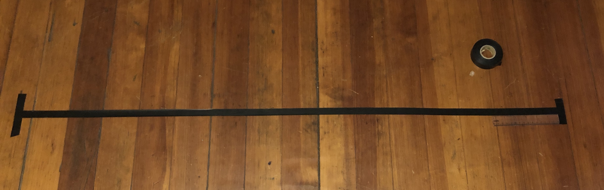

# Milestone 1
## Get the robot to move

# Agenda
- [x] Get familiar with the kit and ZumoShield
- [x] Code 
- [x] Complete the first milestone

### Arena
Since I only had two 15cm-rulers, the arena was set up quite roughly by moving the rulers along.  

Here is the look:  

### Code
I read the documentation and watched the turorial on Moodle, and then wrote the code.
1. Install the ZumoShield Library.
2. Set the SPEED for the motors.
3. Make a stopping point based on the time passed.
  - I first tried 10000ms, finding out that the robot moved much farther than 4 ft with this time duration. After a few more trials of trying, I figured out that 5000ms with a speed of 200 was just fine.

### Milestone1 Completed

*(This is a Youtube link)*  

### Things learnt:
- Define the variables before the loop, so that their values can be modified without having to go through all the code. (Avoid hard coding)
- How to use Github Desktop

