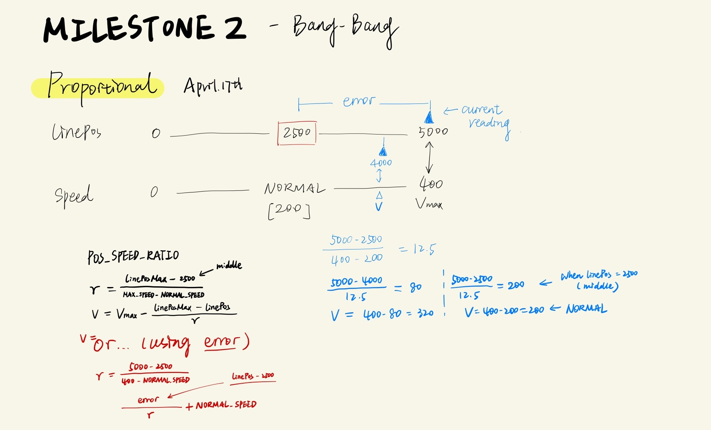

# Milestone 2
## Follow A Line for at least 4 feet

### ATTEMPT 1
- Used the **readline** function to read the position of the line. The reading from the function is stored as a variable *linePos*.
  - 1000 indicates that the line is below sensor1; 5000 indicates that the line is below sensor5... Thus, 2500 is the most optimal position.
- When the reading is between 2000 and 3000, the two motors move at the same speed;
- Otherwise, one motor moves while the other one stops so that the robot can rotate to the right direction.

##### OUTCOME: 
- In Attempt 1, the robot follows the line, yet it's not moving smoothly.   
- The robot is bang-bang-ing from left to right because it is constantly adjusting the motors' speeds, from a constant value to 0, and from 0 to that value...  
After consulting Josh, I got to know the PD control method, and tried to figure it out...

### ATTEMPT 2

Without watching Josh's tutorial, I developed my own method of **"proportional control"**. The idea is to map the speed to the error (distance between the robot and the line).
- The optimal position is 2500, when the line is right below the middle of the robot;  
- The optimal speed I chose is 200 (from a range of 0-400).  
- If the maximum speed allowed for the motor is set to 400, then for every 12.5 error, the speed should change by 1. This makes sure that when the error is the largest, the motor is moving the fastest to get back to the line. When the error is very small, the motor moves very slowly.   

This would allow some smoothness - The robot is not changing speeds and directions suddenly.

- **Speed**
  - The speed is calculated using the formula in the image.
- **Direction**   
**When the error is large enough:**
  - When *linePos* > 2500, the robot is to the left of the line, move the left motor in the calculated speed and stop the right motor;
  - When *linePos* < 2500, the robot is to the right of the line, move the right motor in the calculated speed and stop the left motor;   
  
**When the error is not large:**
  - The robot is in an optimal position, so both motors move in the *normal (optimal) speed* of 200.

#### OUTCOME: 
- The robot is still bang-bang-ing.
- The problem is that 

*(This is a Youtube link)*  

