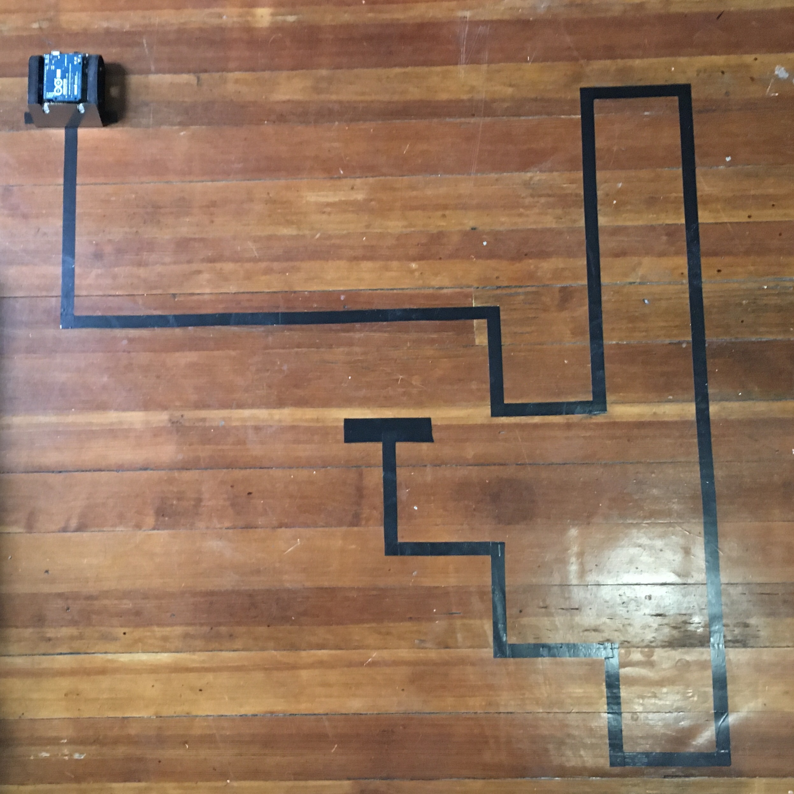
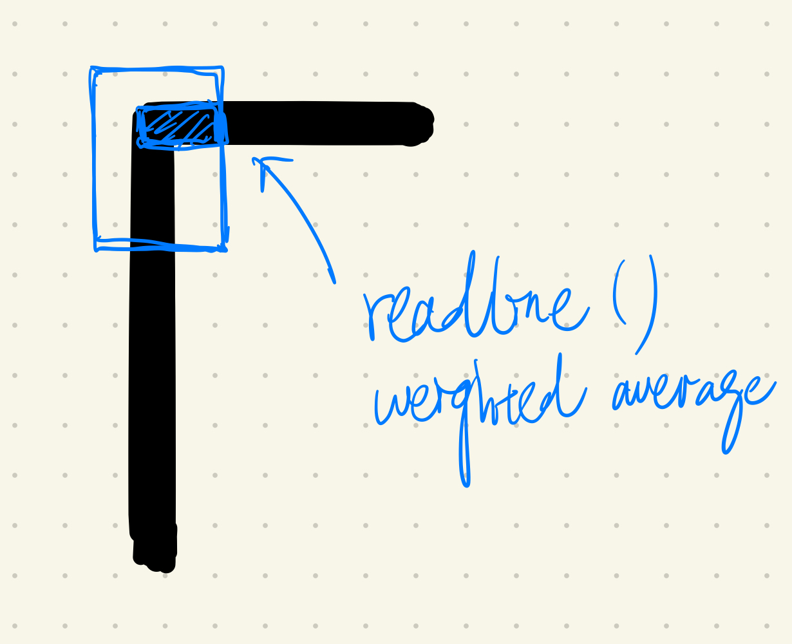

# Milestone 4
## Navigate a single maze with no branching.

### Arena Setup
I set up the arena by leaving out the branches of the final maze layout.

### FEATURE 1. Turning.
In this milestone, a new feature is to turn the robot in a specific direction corresponding to the maze layout.
- Since the turn is always in right angle, the robot will first move beyond the line, reading the maximum error.
- Thus, once the error is read maximum, the robot looks back for the last value of the readline() function. 

- As the diagram explains, if the robot should turn right, the last value it read would indicate that the line is below the right half of the robot. This is because the mechanism of the readline() function is to take the average of the readings in all the sensors.
- **When the last value indicates that the line is below the right half of the robot, the robot turns right.**

#### Problem encountered!
For some reason, the robot is not turning as smoothly to the left as it is to the right, which is a sharp turn. 
After talking to Josh, I added a **while loop** after the robot detects a turning that keeps the robot turning until the line is back to the middle (within the error threshold).
The robot is now performing much better, but it might be tricky sometimes if the turns are close to each other.
I also made the buzzer to produce a **beep** of different pitches when the robot is turning left and right. This is to debug whether the robot is performing the turning behavior or the follow-line behavior.
- Since the robot is confirmed to be turning, the code of the buzzer can be the place to write the code that stores the turnings for the final milestones.

### FEATURE 2. Stop at the end of the maze
- When all sensors on the robot is reading the same value (black), the robot stops.
- Later, I realized that this would confuse the robot between a branching and the end of a maze. This mechanism would be changed for milestone 5.

  
### MILESTONE 4 COMPLETED!   

*(This is a Youtube link)*  

