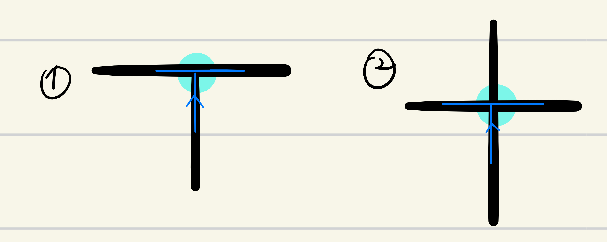

# Milestone 5
## Solve a single maze with branching.

### Arena Setup

### Strategy / Logic
#### 1. Types of Intersections
- Left Turn  

When the line is under the leftmost sensors of the robot, the robot is considered to encounter a left turn.  

- Right Turn  

When the line is under the rightmost sensors of the robot, the robot is considered to encounter a right turn.  

- T Intersection  

When the line is under every sensor of the robot, the robot is considered to encounter a T intersection.  
**The end of the maze is also considered a T intersection.**

- Dead End  

When the line ends without any intersection, the robot is considered to encounter a dead end.

#### 2. Conditions and Actions

As the venn diagram shows, the conditions for t-intersections include the ones for left turns and right turns. Thus, the t-intersection condition must be examined prior to the ones for left and right turns. Otherwise, a t-intersection will never be detected.   
  
The robot follows this logic to execute actions:  

### Problems Encountered

#### 1. super slow turns in the dead-end

#### 2. half-turn vs. full-turn

#### 3. detecting T intersection

  
### MILESTONE 5 COMPLETED!   

*(This is a Youtube link)*  

