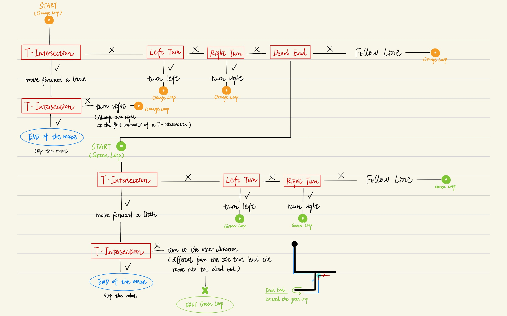

# MILESTONE 5
## Solve a single maze with branching.

### ARENA SETUP

### STRATEGY & LOGIC
#### 1. TYPES OF INTERSECTIONS
- Left Turn  

When the line is under the leftmost sensors of the robot, the robot is considered to encounter a left turn.  

- Right Turn  

When the line is under the rightmost sensors of the robot, the robot is considered to encounter a right turn.  

- T Intersection  

When the line is under every sensor of the robot, the robot is considered to encounter a T intersection.  
**The end of the maze is also considered a T intersection.**

- Dead End  

When the line ends without any intersection, the robot is considered to encounter a dead end.

#### 2. CONDITIONS & ACTIONS 

As the venn diagram shows, the conditions for t-intersections include the ones for left turns and right turns. Thus, the t-intersection condition must be examined prior to the ones for left and right turns. Otherwise, a t-intersection will never be detected.   
  
The robot follows this logic to execute actions:  

### PROBLEMS ENCOUNTERED

#### 1. SUPER SLOW ANTI-CLOCKWISE TURNS AT THE DEAD-ENDS
From time to time, the robot ran into a slow anti-clockwise rotate at a dead-end. Originally, I thought that something was wrong with my left motor, because it only had this behavior anti-clockwise. However, later I discovered that this was due to a line of code: 
> v = error / LINEPOS_SPEED_RATIO + NORMAL_SPEED;  

This was the code to adjust the speed in the follow-line behavior. The problem was that **the error could be negative** based on the following calculation, and the error would be negative only when the line is to the left of the robot - This explains why the weird behavior only happened when turning to the left (anti-clockwise).    

> linePos = sensors.readLine(sensorValues);  
> error = linePos - 2500;   

Thus, I changed the code to the absolute value of error:    

> v = abs(error) / LINEPOS_SPEED_RATIO + NORMAL_SPEED;   

The problem is solved.

#### 2. DETECTING T-INTERSECTIONS
Ideally, the robot should detect a T-intersection when **all of its sensors see black**.  
However, in reality the readings can't be as accurate all the time. The robot missed the T-intersection many times.  
To tackle with this issue, I did two things:  
**1) THRESHOLD**
- The readings of the sensors are not just black(1000)-or-white(0). It could also be values in between due to lightings or other factors.
- Thus, I had **a threshold of 200** after observing the Serial Monitor that prints the individual reading of each sensor. I found out that the readings would usually be below 100 if a sensor doesn't read a line.

**2) CURRENT READINGS VS. CHANGE OF THE READINGS**
- After having a threshold, the robot still miss T-intersections from time to time.
- I guessed that it was because the robot didn't always come to the intersection perpendicularly. When it was adjusting the line position in the follow-line condition (which has an error threshold too), it could **approach the intersection with a slight angle**. 
- This can result in **some sensors detecting the black line prior to the others**. Thus, sometimes the robot would **detect a left/right turn before all of its sensors saw black and told that it was actually a T-intersection**.
- To deal with this, I printed the sensor values and tried to find a pattern.  

By observing the readings in different conditions, I figured out two solutions, as shown in the graph.
- SOLUTION 1: Apart from the readings, it makes sense to choose sensor[1] and sensor[4] and see their change of readings, instead of the leftmost and rightmost sensor[0] and sensor[5]. This is because if the robot is approaching in an angle, sensor[1] and [4] will always see black sooner than the outer sensors[0] and [5]. 
- SOLUTION 2 might seem simpler than SOLUTION 1, but I chose to use SOLUTION 1 for now. This is to avoid the situation where due to somehow a larger angle, the outer sensors' readings are not larger than 100 yet. 
  
SOLUTION 1 nicely solved the issue.

  
### MILESTONE 5 COMPLETED!   

*(This is a Youtube link)*  

#### PATH STORED
As I coded for Milestone5, I also had the paths stored in advance for Milestone6. I tested the path using the buzzer - When the robot reaches the end, it buzzes the path it memorizes. C4- left turn; C5- right turn; G- ignore the intersection and go forward. As you may see, the path is correctly memorized!   
The logic will be explained in the note for Milestone 6.
