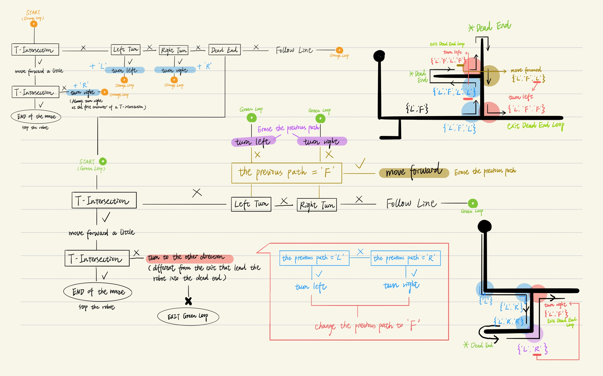

# MILESTONE 6
## Solve a maze with branching; repeat and follow a memorized path.

As Milestone 5 had already examined the accuracy of the logic, milestone 6 was completed very quickly.

### LOGIC
#### ARRAY
- I created a large array (size 100) of characters. 
- The array is updated everytime the robot executes an action.
#### Cursor
- There is an int cursor that keeps track of where we are in the array. 
#### UPDATING THE ARRAY
;
The above explains how the code updates the path's array.   
The most complicated logic is in the dead-end loop.   
Note that a condition is added: when the robot detects a left/right turn in a dead-end loop, it looks at the previous path memorized. If the previous path is ‘F’ (forward), it will ignore the turn and move forward.   
While updating the array, the cursor is also updated accordingly, so that it indicates where the next action should be recorded in the array.

### FOLLOW THE MEMORIZED PATH
After the robot arrives at the end, it has an updated reduced path memorized in the array.  
Then, after the user places the robot back to the start and presses the button, the robot will run the memorized path.  
Whenever it sees a type of intersection, it looks into the array and execute the corresponding action stored.  
After it goes through every element in the array, it follows the line until reaching the end. At the end, the entire program exits along the mario-theme song (cr.Josh). :)

  
### MILESTONE 6 COMPLETED!  

*(This is a Youtube link)*  
 
